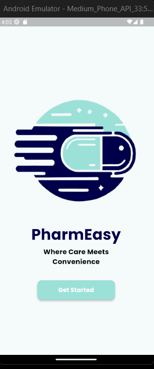
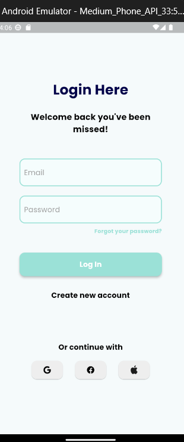
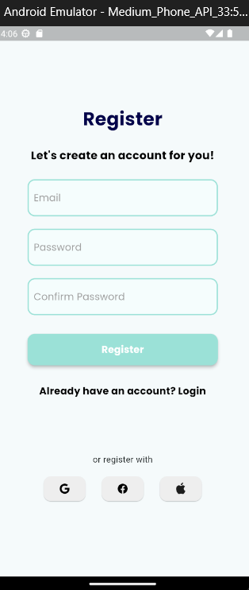
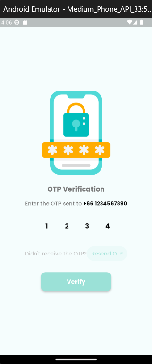
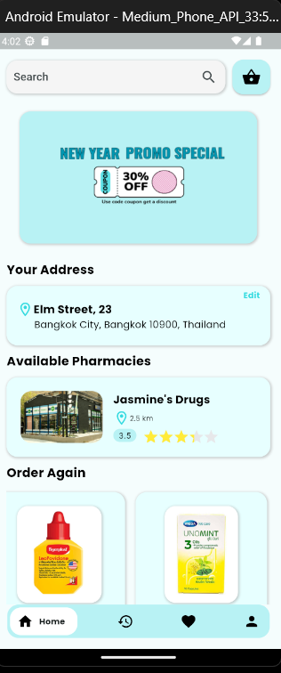
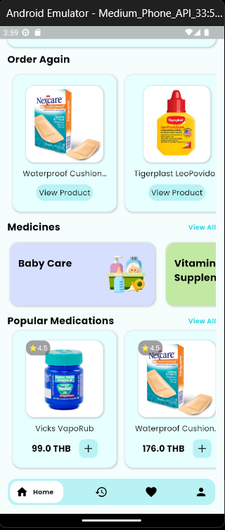
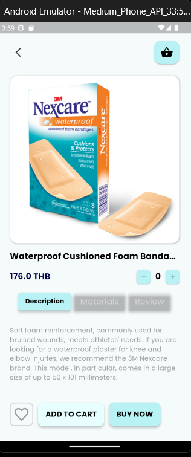
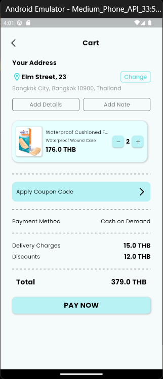

# PharmEasy
This project is a mock telepharmacy application designed to offer digital medical consultations and medication delivery, targeting individuals who lack transportation, live in remote areas, or face difficulties visiting pharmacies due to long wait times or health issues. The app was developed using Flutter for mobile development and Firebase for the backend.

## Features
Since this project is not yet complete, its current features include:
- **Registration**: Sign up with email and password
- **Login**: Login with email and password
- **App Homepage**: The homepage contains user mock address, promotional banners, and mock medication categories and catalog
- **Medication Details**: Shows information about selected medication
- **Add to Cart**: Allows users to add specific medications to their cart.
- **Shopping Cart**: Display medication selected and calculates the total price.

## UI 

  

    
  

  
  

    
  

  
  

    
  

  
  

    
  

  
  

    
  

  
  

    
  

  
  

    
  

  
  

    
  

